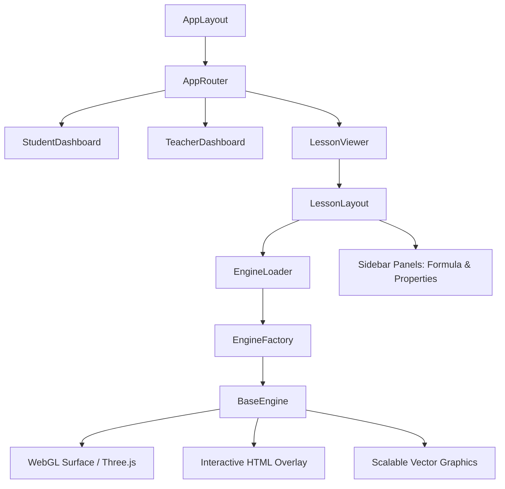

# AR Smart Lab: Project Audit Report

This document provides a comprehensive audit of the **AR Smart Lab** application architecture, state management, classroom capabilities, PWA features, and offline capability.

---

## 1. System & Engine Architecture

AR Smart Lab is built on a modular **Render Surface Architecture** that decouples lesson loading and teacher dashboards from the rendering technologies chosen by individual math engines.

### Rendering Surfaces
- **WebGL/Three.js Surface:** Used by the **Triangle Engine** and **Fraction Engine** (3D representation mode). This surface is managed via React Three Fiber (R3F) and `@react-three/drei`.
- **Interactive HTML Surface:** Used by the **Algebra Engine** for formula workspaces, drag-and-drop algebra tiles, and seesaw balance scales.
- **SVG Canvas Surface:** Used by the **Graph & Coordinate Geometry Engine** for pixel-perfect coordinates plotting, vectors, infinite grid panning, zooming, and statistics chart visualizations.

---

## 2. State Management Architecture

State is managed globally and reactively using **Zustand** stores, isolating cross-cutting concerns (voice, settings, lessons) from immediate engine instances:

| Store Name | File Path | Key State & Operations |
| :--- | :--- | :--- |
| **LessonStore** | `src/store/LessonStore.ts` | Discovered lessons, active lesson, step progress, classroom bookmark lists, and theme selectors. |
| **ThemeStore** | `src/store/ThemeStore.ts` | Dark mode toggle, injecting classes dynamically into the HTML root element. |
| **SettingsStore** | `src/store/SettingsStore.ts` | High contrast toggles, large text multipliers, and speech narration configurations. |
| **GeometryStore** | `src/store/useGeometryStore.ts` | Calculated shapes statistics, vertices coordinates, and shared properties panel sync. |
| **AlgebraStore** | `src/engines/implementations/algebra/useAlgebraStore.ts` | Algebra tiles, linear equation string simplifies, and mistake explanations. |
| **GraphStore** | `src/engines/implementations/graph/useGraphStore.ts` | Plotted points, vector elements, statistics data, zoom levels, pan offsets, and **Undo/Redo history stack**. |

---

## 3. Modular Capability Audit

### A. Lesson Discovery System
- **Mechanism:** Scans Grade levels (`class-6` to `class-10`) subdirectories under `Data/json/mathematics/` dynamically.
- **Lesson Package Contract:** Every lesson package is fully modular, containing:
  - `metadata.json` (estimated duration, category, difficulties)
  - `lesson.json` (learning objectives, theory text, formulas, steps)
  - `quiz.json` (NCERT-aligned multiple-choice questions)
  - `assets.json` (external icons and images mapping)
  - `translations.json` (linguistic support keys)

### B. Teacher & Student Dashboards
- **Student Dashboard:** Displays curriculum tracks, grade-level selection filters, badges earned, and aggregate XP completion.
- **Teacher Dashboard:** Apple Education-inspired classroom console displaying:
  - Dynamic mock metrics (class participation rates, average score percentage, progress bars).
  - Lesson launchers mapping to standard student layouts or projection-optimized Presentation Mode.
  - Markdown-enabled teaching notepad persisting notes locally via storage services.

### C. Voice Narration System
- **Narration Hook:** `useVoiceAdapter()` utilizes the native **HTML5 Web Speech Synthesis API** (`speechSynthesis`), reading out math concepts, step explanations, and formulas.
- **Narration Sync:** Narrative instructions can be muted or paused from the floating classroom console.

### D. AI Tutor & Mistake Engine
- **AI Tutor Interface:** Floating chatbot panel that reads the active lesson context to guide the student with contextual questions.
- **Mistake Engine:** Intercepts student steps (such as algebra tile dragging or balance scale equations) and generates pedagogical, encouraging guidance explaining *why* a move was incorrect rather than just displaying a generic "fail" prompt.

---

## 4. Offline & PWA Audit

- **PWA Capabilities:** Configured via `vite-plugin-pwa` (Workbox) to support fully offline laboratory execution.
- **Assets Cached:** App shell code, local data JSONs, 3D asset `.glb` meshes, fonts, and icons.
- **Storage Service:** Fallback mechanisms are integrated in `StorageService.ts` to sync with localStorage, isolating all components from eventual cloud storage upgrades.
